# Mục lục
<!-- TOC -->
- [Mục lục](#m%E1%BB%A5c-l%E1%BB%A5c)
- [1. Định lý CAP](#1-%C4%91%E1%BB%8Bnh-l%C3%BD-cap)
- [2. Khái niệm `eventual consistency`](#2-kh%C3%A1i-ni%E1%BB%87m-eventual-consistency)
- [3. Khái niệm `throughput`, `latency`](#3-kh%C3%A1i-ni%E1%BB%87m-throughput-latency)
- [4. Các phương pháp để scale database](#4-c%C3%A1c-ph%C6%B0%C6%A1ng-ph%C3%A1p-%C4%91%E1%BB%83-scale-database)
  - [4.1. Replication](#41-replication)
    - [4.1.1. Master-slave replication](#411-master-slave-replication)
    - [4.1.2. Master-master replication](#412-master-master-replication)
  - [4.2. Federation](#42-federation)
  - [4.3. Sharding](#43-sharding)
  - [4.4. Denormalization](#44-denormalization)
  - [4.5. SQL tuning](#45-sql-tuning)
- [5. Task queue khác gì message queue?](#5-task-queue-kh%C3%A1c-g%C3%AC-message-queue)
- [6. Bài tập](#6-b%C3%A0i-t%E1%BA%ADp)
  - [6.1. Load balancer](#61-load-balancer)
    - [6.1.1. Khái niệm về load balancer](#611-kh%C3%A1i-ni%E1%BB%87m-v%E1%BB%81-load-balancer)
    - [6.1.2. Kiến trúc bên trong nginx. Tại sao nginx dùng single thread?](#612-ki%E1%BA%BFn-tr%C3%BAc-b%C3%AAn-trong-nginx-t%E1%BA%A1i-sao-nginx-d%C3%B9ng-single-thread)
    - [6.1.3. Thí nghiệm:](#613-th%C3%AD-nghi%E1%BB%87m)
      - [6.1.3.1. Làm một web tĩnh đơn giản viết bằng python](#6131-l%C3%A0m-m%E1%BB%99t-web-t%C4%A9nh-%C4%91%C6%A1n-gi%E1%BA%A3n-vi%E1%BA%BFt-b%E1%BA%B1ng-python)
      - [6.1.3.2. Cho web chạy trên 2 port khác nhau](#6132-cho-web-ch%E1%BA%A1y-tr%C3%AAn-2-port-kh%C3%A1c-nhau)
      - [6.1.3.3. Cài đặt nginx để load balancing giữa 2 port trên (verify lại bằng browser)](#6133-c%C3%A0i-%C4%91%E1%BA%B7t-nginx-%C4%91%E1%BB%83-load-balancing-gi%E1%BB%AFa-2-port-tr%C3%AAn-verify-l%E1%BA%A1i-b%E1%BA%B1ng-browser)
  - [6.2. Caching](#62-caching)
    - [6.2.1. Vai trò của cache, các thuật toán apply cho cache (LRU, LFU)](#621-vai-tr%C3%B2-c%E1%BB%A7a-cache-c%C3%A1c-thu%E1%BA%ADt-to%C3%A1n-apply-cho-cache-lru-lfu)
    - [6.2.2. Cài đặt nginx để phục vụ trang web tĩnh. Tìm cách để bật module cache cho nginx](#622-c%C3%A0i-%C4%91%E1%BA%B7t-nginx-%C4%91%E1%BB%83-ph%E1%BB%A5c-v%E1%BB%A5-trang-web-t%C4%A9nh-t%C3%ACm-c%C3%A1ch-%C4%91%E1%BB%83-b%E1%BA%ADt-module-cache-cho-nginx)
  - [6.3. Redis](#63-redis)
    - [6.3.1. Khái niệm cơ bản về Redis](#631-kh%C3%A1i-ni%E1%BB%87m-c%C6%A1-b%E1%BA%A3n-v%E1%BB%81-redis)
    - [6.3.2. Các cấu trúc dữ liệu của Redis. Khi nào dùng `hyperloglog`](#632-c%C3%A1c-c%E1%BA%A5u-tr%C3%BAc-d%E1%BB%AF-li%E1%BB%87u-c%E1%BB%A7a-redis-khi-n%C3%A0o-d%C3%B9ng-hyperloglog)
    - [6.3.3. Cách đặt tên key cho phù hợp](#633-c%C3%A1ch-%C4%91%E1%BA%B7t-t%C3%AAn-key-cho-ph%C3%B9-h%E1%BB%A3p)
    - [6.3.4. Config cluster redis 3 node, chạy cùng machine, khác port](#634-config-cluster-redis-3-node-ch%E1%BA%A1y-c%C3%B9ng-machine-kh%C3%A1c-port)
    - [6.3.5. Chương trình chat đơn giản sử dụng Redis pub/sub (dùng Java, Maven, và thư viện Redisson). Lưu dữ liệu chat cho mỗi người, set expire trong 1 ngày](#635-ch%C6%B0%C6%A1ng-tr%C3%ACnh-chat-%C4%91%C6%A1n-gi%E1%BA%A3n-s%E1%BB%AD-d%E1%BB%A5ng-redis-pubsub-d%C3%B9ng-java-maven-v%C3%A0-th%C6%B0-vi%E1%BB%87n-redisson-l%C6%B0u-d%E1%BB%AF-li%E1%BB%87u-chat-cho-m%E1%BB%97i-ng%C6%B0%E1%BB%9Di-set-expire-trong-1-ng%C3%A0y)


# 1. Định lý CAP
-   Định lý CAP là một lý thuyết trong khoa học máy tính được phát biểu bởi giáo sư **Eric Allen Brewer** của trường đại học California trực thuộc Berkeley
-   Định lý CAP phát biểu như sau:
    
    Trong một hệ thống lưu trữ phân tán không thể đồng thời đảm bảo nhiều hơn 2 trong 3 tính chất sau:
    -   **Availability (Tính sẵn sàng)**: Mỗi yêu cầu nhận được phản hồi (không phải lỗi) - không đảm bảo rằng nó chứa các ghi chép mới nhất 
    -   **Consistency (Tính nhất quán)**: Mỗi lần đọc dữ liệu, sẽ nhận được nội dung mới nhất hoặc lỗi
    -   **Partition Tolerance (Khả năng chịu lỗi)**: Hệ thống tiếp tục hoạt động bất chấp một lượng tùy ý các thông điệp bị mất hoặc trì hoãn do trục trặc mạng giữa các nút
-  Định lý CAP phân loại hệ thống thành 3 loại khác nhau:
   -  **CP - consistency and partition tolerance**: chờ phản hồi từ nút đã phân vùng có thể dẫn đến lỗi time out.   
   -  **CA - consistency and availability**: một instance độc lập không phụ thuộc liên quan đến lỗi mạng trong cụm. Ví dụ, instance database MySQL, Oracle, Mongo,...
   -  **AP - availability and partition tolerance**: phản hồi trả về phiên bản mới nhất của dữ liệu có sẵn trên một nút, có thể không phải là phiên bản mới nhất. Việc ghi có thể mất một thời gian để truyền ra khi phân vùng được giải quyết. AP là sự lựa chọn tốt nếu nghiệp vụ cần cho phép `eventual consistency` (nhất quán đến cùng) hay hệ điều hành vẫn tiếp tục làm việc dù cho có các lỗi bên ngoài.
-   Ý nghĩa:
    -   Hiểu về CAP tức là hiểu được lý do và chấp nhận sự `không hoàn hảo` của mọi hệ thống. Khi chọn 2 cặp tính chất phải đánh đổi bằng cặp tính chất quan trọng khác
    -   Muốn Database đảm bảo độ chính xác cao nhất trong quá trình đọc/ghi/cập nhật các tác vụ quan trọng (transaction) &rarr; mô hình `Master only`. Muốn tối ưu việc đọc có thể chọn mô hình `Master- Slave`, truy vấn đọc sẽ được thực hiện và chấp nhận trạng thái Slave có thể không đồng bộ với Master dẫn đến dữ liệu bị sai lệch khi truy vấn vào 

-   Cách nhất quán dữ liệu trong cụm:
    -   **Weak consistency (Nhất quán yếu)**: sau khi ghi, việc đọc có thể nhìn thấy hoặc không. Hoạt động tốt với ứng dụng VoIP, video chat, game online (các ứng dụng cần phản hồi nhanh, chịu mất mát thông tin)
    -   **Eventual consistency (Nhất quán cuối cùng)**
    -   **Strong consistency (Nhất quán mạnh)**: Sau khi cập nhật được diễn ra thì tất cả các lần đọc sau đó đều trả về giá trị mới được cập nhật. Dữ liệu được nhân bản một cách đồng bộ. Được sử dụng ở các hệ thống file hoặc cơ sở dữ liệu quan hệ. Hữu ích với các ứng dụng dùng giao tác (mô hình ACID) 

# 2. Khái niệm `eventual consistency`
-   `Eventual consistency` (nhất quán cuối cùng): Sau khi một cập nhật được diễn ra, các lần đọc sau đó không đảm bảo sẽ luôn trả về giá trị mới được cập nhật (có thể có lần đọc vẫn trả về dữ liệu cũ). Tuy nhiên, sau một khoảng thời gian (đồng bộ giữa các CSDL) thì cuối cùng các lần đọc đều trả về giá trị mới nhất. 
-   Nhất quán cuối cùng nên được sử dụng cho các ứng dụng cần tính sẵn sàng cao (Mô hình BASE)
-   Các cách để hệ thống sẵn sàng cao:
    
    -   **Master - Slave**
    -   **Master - Master**
-   Ví dụ:
    -   Một anh chàng tên Công, có sở thích sưu tập phim và toàn bộ những bộ phim anh ta tải được trên mạng đều được lưu vào laptop. Laptop ở đây đóng vai trò như một CSDL.
    -   Do sợ vào một ngày đẹp trời laptop bị ăn trộm hoặc bị hỏng sẽ làm mất hết toàn bộ phim trong máy nên Công mua thêm một ổ cứng di động 8TB và một tài khoản Dropbox để sao lưu lại toàn bộ dữ liệu cho an toàn. Lúc này Laptop, ổ cứng di động và tài khoản Dropbox được coi như một hệ CSDL phân tán (theo mô hình Master - Slave).

-   Khi sử dụng nhiều replica (bản sao) cho một CSDL, giả sử có một write request đến một replica (insert, update, delete dữ liệu) thì chúng ta phải làm sao cho các replica còn lại cũng nhận được request tương ứng để đồng bộ dữ liệu.
-   Việc đồng bộ dữ liệu này sẽ tốn thời gian (có thể rất nhỏ), nhưng trong khoảng thời gian đó, nếu có một read request đến một replica chưa đồng bộ xong thì request đó sẽ nhận được kết quả cũ hơn (stale data).


-   Quay lại ví dụ của Công:

    - Cứ mỗi tuần vào tối Thứ Sáu Công sẽ đồng bộ dữ liệu trong laptop với ổ cứng di động.

    - Tối Chủ Nhật, Vương là bạn của Công mượn ổ cứng di động của Công để xem phim. Lúc này Vương có thể lấy luôn ổ cứng mang về và có toàn bộ dữ liệu cho đến lần sao lưu gần nhất (tức là nếu Thứ Bảy hoặc sáng Chủ Nhật Công download thêm phim thì trong ổ cứng sẽ không có).

    - Sáng Thứ Hai tuần sau, Vương trả lại ổ cứng cho Công và đến tối Chủ Nhật lại mượn tiếp. Thời điểm đó Vương sẽ lại có được toàn bộ phim (bao gồm cả những phim chưa kịp đồng bộ trong tuần này).

**&rarr; Eventual Consistency thì có độ trễ thấp, kết quả trả về nhanh nhưng dữ liệu nhận được có thể không phải mới nhất.**

# 3. Khái niệm `throughput`, `latency`

-   `throughput`: là số lượng hành động hoặc kết quả trên một đơn vị thời gian
-   `latency`: là thời gian để thực hiện hành động hoặc tạo ra kết quả
-   Mục tiêu là làm sao cho tối đa hóa `throughput` với `latency` chấp nhận được
-   `P99 latency`: hay còn gọi là 99th percentile. Nghĩa là 99% requests phải nhanh hơn một latency đưa ra. Nói cách khác, chỉ có 1% requests được phép chậm hơn latency đưa ra. `P99 latency` được sử dụng phổ biến trong đánh giá băng thông mạng.
# 4. Các phương pháp để scale database


-   RDBMS - Relational database management system: một cơ sở dữ liệu quan hệ ví dụ như SQL là một tập hợp các dữ liệu được thu thập và tổ chức trong các bảng hay còn gọi là các quan hệ
-   ACID là một tập hợp các tính chất của giao dịch cơ sở dữ liệu quan hệ - `transaction`:
    -   `Atomicity` - Đặc tính nguyên tử : 
        -   Mỗi transaction một là thực hiện tất cả - hai là không làm gì cả. Tức là hành động của một transaction cần được thực hiện thành công hoặc ngược lại nếu có một hành động không được thực hiện thì sẽ không có bất cứ hành động nào khác được thực hiện thành công.
        -   Gọi là đặc tính nguyên tử bởi vì từng hành động riêng rẽ này giống như các electron quay xung quyanh một hạt nhân và khi hạt nhân di chuyển thì tất cả các electron này sẽ di chuyển cùng nhau mà không cho phép một electron nào rời khỏi quỹ đạo.
    -   `Consistency` - Đặc tính nhất quán: 
        -   Tại bất kỳ thời điểm nào, trước hoặc sau một transaction được thực hiện dù lỗi hay không lỗi, thì database vẫn phải được giữ ở trạng thái hợp lệ (ví dụ dữ liệu phải phù hợp với các quy định được định nghĩa cho database).
    -   `Isolation` - Đặc tính độc lập: 
        -   Từng transaction khác nhau cần phải được thực hiện trong một môi trường độc lập, nếu có 2 transaction diễn ra tại cùng một thời điểm thì cần một cơ chế đảm bảo transaction này không ảnh hưởng tới transaction khác.
        -   Ví dụ nếu trong trường hợp có một khách hàng chuyển 10 triệu đồng vào tài khoản của công ty AAA tại Vietcombank ngay tại thời điểm chị Alice thực hiện việc rút 10 triệu đồng. Điều gì sẽ diễn ra? Lúc này database sẽ phải thực hiện hai hành động sau cùng một thời điểm:

            -   Thực hiện cập nhật số tiền trong tài khoản của công ty ACB bằng cách trừ đi 10 triệu từ số dư hiện tại (= 500 triệu = 10 triệu)
            -   Thực hiện cập nhật số tiền trong tài khoản của công ty ACB bằng cách cộng thêm 10 triệu từ số dư hiện tại (= 500 triệu + 10 triệu)

        -   Tài khoản của công ty AAA ngân hàng Vietcombank sau hai hành động này cuối cùng sẽ là bao nhiêu 500 triệu (= 500 triệu - 10 triệu + 10 triệu) hay 510 triệu (500 triệu + 10 triệu) hay sẽ chỉ còn 490 triệu (500 triệu - 10 triệu)?

        -   Với đặc tính độc lập của transaction được đưa ra để đảm bảo khi transaction diễn ra thì dữ liệu liên quan trên database sẽ bị khoá lại. Do đó các hành động khác (hay transaction khác) hoặc là sẽ phải đợi cho tới khi transaction ban đầu được hoàn tất hoặc là sẽ bị báo gặp phải lỗi.
    -   `Durability` - Đặc tính bền vững: 
        -   Khi transaction được diễn ra (thành công hoặc rollback lại khi có lỗi) thì sau đó dù có bất cứ sự cố nào diễn ra với database (mất điện, server tràn bộ nhớ...) thì khi được khôi phục lại thì dữ liệu được khôi phục sẽ giữ nguyên trạng thái trước khi có sự cố (đảm bảo không có bất cứ transaction trước đó không bị mất).
-  Có nhiều kỹ thuật dùng để scale cơ sở dữ liệu quan hệ: master-slave replication, master-master replication, federation, sharding, denormalization, và SQL tuning

## 4.1. Replication
### 4.1.1. Master-slave replication
-   Server phục vụ đọc và ghi, nhân bản các dữ liệu được ghi ra slave, nơi mà dữ liệu chỉ được đọc. Các slave có thể nhân bản ra các slave khác theo dạng cây. Nếu master gặp vấn về, hệ thống sẽ ở trạng thái chỉ đọc cho đến khi một slave được đưa lên làm master  hoặc master được khôi phục


-   Điểm yếu của Master-slave:
    -   Để đưa một slave lên làm master cần logic bổ sung
  
### 4.1.2. Master-master replication
-   Tất cả đều hỗ trợ đọc - ghi, các server là ngang hàng về việc ghi. Nếu một master có vấn đề, hệ thống vẫn tiếp tục điều hướng đọc ghi sang node khác

-   Điểm yếu của Master-master:
    -   Bạn cần một load balancer hoặc bận cần thay đổi logic ứng dụng của bạn để xác định chỗ nào để ghi
    -   Phần lớn các hệ thống Master-master hoặc nhất quán lỏng lẻo (vi phạm ACID) hoặc tăng độ trễ việc ghi do đồng bộ
    -   Giải quyết xung đột xuất hiện nhiều hơn khi thêm vào nhiều nút ghi và độ trễ tăng lên
-  Điểm yếu của replication:
   -  Có khả năng mất dữ liệu nếu master có vấn đề trước khi bất kì dữ liệu ghi mới nào được sao y đến nút khác
   -  Ghi được phát lại thành các bản sao đọc. Nếu có nhiều ghi, các bản sao đã đọc có thể bị sa lầy với việc ghi lại và không thể thực hiện nhiều lần đọc.
   -  Càng nhiều slave đọc, bạn càng phải sao y, điều này dẫn đến độ trễ sao y lớn hơn
   -  Trên một số hệ thống, ghi nhiều master có thể sinh ra nhiều luồng để ghi song song, trong khi bản sao đọc chỉ hỗ trợ đọc với một luồng duy nhất
   -  Replication - sao y yêu cầu độ phức tạp và phần cứng bổ sung

## 4.2. Federation

-   Federation (hay còn gọi là functional partitioning) chia cắt database theo hàm.
-   Ví dụ, thay vì chỉ dùng một database duy nhất, chúng ta có thể chia ra làm 3 database: forums, users và products, điều này giúp giảm thiểu việc đọc và ghi đối với mỗi database cho nên giảm độ trễ sao y
-   Database nhỏ hơn dẫn đến nhiều dữ liệu vừa vặn lưu trong bộ nhớ, lần lượt dẫn đến cache hit nhiều hơn do miền cache được cải thiện
-   Không có bản ghi tuần tự master trung tâm duy nhất, nên tăng thông lượng (throughput)
-   Điểm yếu:
    -   Federation không hiệu quả nếu lược đồ yêu cầu số lượng hàm và bảng nhiều
    -   Bạn cần cập nhật logic ứng dụng để quyết định database nào cần đọc và ghi
    -   Kết dữ liệu từ 2 database phức tạp hơn với một server link
    -   Federation yêu cầu độ phức tạp phần cứng và bổ sung
  
## 4.3. Sharding


-   Sharding là một tiến trình lưu giữ các bản ghi dữ liệu qua nhiều thiết bị để đáp ứng yêu cầu về sự gia tăng dữ liệu. 
-   Khi kích cỡ của dữ liệu tăng lên, một thiết bị đơn, một thiết bị đơn (1 database hay bảng) không thể đủ để lưu dữ liệu. Sharding giải quyết vấn đề này với việc mở rộng phạm vi theo bề ngang (horizontal scaling). Bổ sung thêm nhiều thiết bị để hỗ trợ gia tăng dữ liệu và các yêu cầu khác
-   Đối với những hệ thống có dữ liệu rất lớn thì khi đó việc truy vấn trở nên ì ạch và tốn nhiều dung lượng bộ nhớ. Sharding giúp ta giải quyết vấn đề này nhanh chóng bằng cách chia nhỏ bảng hay database thành các phần khác nhau có cấu trúc dữ liệu giống nhau để giảm tải thay cho việc chỉ dùng một bảng.

-   Giống như các điểm mạnh của federation, sharding giảm thiểu việc đọc ghi, tăng cache hit. Kích thước của các mục trong bảng cũng được cắt giảm, cải thiện truy vấn. Nếu một shard trục trặc, shard còn lại vẫn hoạt động, tuy nhiên vẫn cần sao lưu các shard để tránh mất dữ liệu

-   Điểm yếu:
    -   Cần cập nhật logic ứng dụng để làm việc với shards, điều này dẫn đến câu truy vấn SQL sẽ rờm rà, phức tạp
    -   Phân bố dữ liệu có thể bị mất cân bằng trong 1 shard. Ví dụ, nhiều người sử dụng 1 shard dẫn đến tăng tải shard đó so với các shard khác
    -   Kết dữ liệu từ nhiều shard khá phức tạp
    -   Sharding yêu cầu độ phức tạp phần cứng và bổ sung

## 4.4. Denormalization
-   Denormalization cố gắng cải thiện hiệu năng đọc với chi phí của một vài hiệu năng ghi
-   Các bản sao dữ liệu dư thừa được ghi trong nhiều bảng để tránh liên kết chi phí cao
-   Đối với dữ liệu lưu trữ phân tán như kỹ thuật sharding và federation thì việc xử lý kết dữ liệu càng phức tạp. Denormalization có thể giảm thiểu độ phức tạp khi join
-   Điểm yếu:
    -   Dữ liệu có thể bị trùng lặp
    -   Các ràng buộc giúp bản sao dư thừa lưu giữ đồng bộ, tăng độ phức tạp khi thiết kế database
    -   Cơ sở dữ liệu đã chuẩn hóa ngược dưới tải nặng có thể tệ hơn dạng chuẩn hóa

## 4.5. SQL tuning
-   Tối ưu schema:
    -   MySQL kết nối với ổ đĩa theo các block liền kề hỗ trợ truy cập nhanh
    -   Sử dụng `CHAR` thay vì `VARCHAR` cho các trường dữ liệu cố định:
        -   `CHAR` cho phép truy cập ngẫu nhiên nhanh và hiệu quả, trong khi `VARCHAR` phải tìm vị trí kết thúc chuỗi trước khi chuyển sang chuỗi khác
    -   `TEXT` sử dụng cho các block lớn của văn bản như là các blog post. `TEXT` cũng cho phép boolean search. Sử dụng trường `TEXT` dẫn đến lưu trữ một con trỏ trên đĩa được dùng để xác định text block
    -   Sử dụng `INT` cho các số nguyên lên đến 2^32 hay 4 tỉ
    -   Sử dụng `DECIMAL` cho đơn vị tiền tệ để tránh lỗi biểu diễn dấu chấm động
    -   `VARCHAR(255)` là số lượng nhiều nhất các ký tự có thể trên 8-bit,  thường thì tối đa hóa việc sử dụng 1 byte trong một số RDBMS
    -   Thiết lập ràng buộc  `NOT NULL` khi áp dụng improve search performance
-   Sử dụng index tốt:
    -   Các cột khi bạn truy vấn sẽ nhanh hơn với index
    -   Index thường đại diện như B-tree tự cân bằng cho phép tìm kiếm, truy cập, thêm, xóa trong thời gian logaric
    -   Thêm index tức là thêm dữ liệu trong bộ nhớ 
    -   Việc ghi có thể chậm hơn vì index cần được cập nhật
    -   Khi load một lượng lớn dữ liệu, sẽ nhanh hơn nếu tắt đi index, load dữ liệu lên sau đó tạo lại index
-   Tránh phép kết chi phí cao:
    -   Denormalize khi cần 

# 5. Task queue khác gì message queue?


-   Message queue:
    -   Message queue nhận, giữ, và chuyển phát messages. Nếu một thao tác quá chậm để thực hiện nội tuyến, bạn có thể sử dụng message queue với work flow bên dưới:
        -   Một ứng dụng đưa công việc đến hàng đợi, sau đó báo người dùng trạng thái của công việc đó
        -   Một worker lấy công việc trong hàng đợi, xử lí nó, báo công việc hoàn thành
    -   Người dùng không bị chặn và công việc được xử lý trong nền. Trong thời gian đó, client có lựa chọn thực hiện xử lí nhỏ làm nó có vẻ như công việc vừa hoàn thành. Ví dụ, nếu đăng một bài trên tweeter, bài tweet có thể ngay lập tức xuất hiện trên timeline, nhưng sẽ mất một khoảng thời gian để thực sự chuyển bài đó đến tất cả người follow bạn
    -   `Redis` hữu ích như một nhà môi giới message nhưng các messages có thể bị mất
    -   `RabbitMQ` phổ biến nhưng yêu cầu bạn phải thích ứng giao thức 'AMQP' và quản lí nút của bạn
    -   `Amazon SQS` được host nhưng có thể có độ trễ cao và có khả năng message được chuyển phát 2 lần  

-   Task queue
    -   Task queue nhận các task và dữ liệu liên quan, chạy chúng sau đó chuyển phát kết quả của chúng
    -   Chúng có thể hỗ trợ scheduling và được dùng để chạy các công việc tính toán chuyên sâu trong nền
    -   `Celery` hỗ trợ scheduling và chủ yếu có python support


# 6. Bài tập

## 6.1. Load balancer


Khi một hệ thống có quá nhiều người sử dụng, một server đơn lẻ không đáp ứng được lượng request khổng lồ được gửi đến cùng lúc. Bạn cần chia sẻ công việc của server hiện tại với các server khác nữa. Khi đó, load balancing - cân bằng tải sẽ xử lí việc này

### 6.1.1. Khái niệm về load balancer
-   Load balancing (Cân bằng tải) là việc phân phối hiệu quả lưu lượng truy cập đến trên một nhóm backend servers, hay còn gọi là server farm hay server pool
-   Các trang web hiện nay có lưu lượng truy cập rất cao, phải phục vụ hàng trăm ngàn lượt request đồng thời từ người dùng, tất cả phải thực hiện nhanh chóng và đáng tin cậy. Để đáp ứng yêu cầu đó, best practice tốt nhất thường dùng là sử dụng thêm server

-   Một load balancer hoạt động như một "traffic cop" (cảnh sát giao thông) ở phía trước server và routing các request của client trên tất cả các server có khả năng thực hiện request đó, sao cho tối ưu về tốc độ và hiệu suất nhất và đảm bảo rằng không có server nào hoạt động quá mức
-   Nếu một server đơn lẻ bị hỏng, load balancer sẽ chuyển hướng lưu lượng truy cập đến các server trực tuyến còn lại
-   Khi một server mới thêm vào nhóm máy chủ, load balancer sẽ tự động bắt đầu gửi yêu cầu đến máy chủ mới thêm này
-   Tóm lại, load balancer có chức năng chính sau đây:
    -   Phân phối các client requests hoặc network load một cách hiệu quả trên nhiều servers
    -   Đảm bảo tính khả dụng và độ tin cậy cao bằng cách chỉ gửi các yêu cầu đến các máy chủ trực tuyến
    -   Thêm vào hoặc loại bớt servers theo yêu cầu linh hoạt và dễ dàng

### 6.1.2. Kiến trúc bên trong nginx. Tại sao nginx dùng single thread?

-   Trong khi nhiều máy chủ web và máy chủ ứng dụng kiến trúc một luồng đơn giản hay dựa trên quy trình thì nginx nổi bật với kiến trúc hướng sự kiện tinh vi cho phép mở rộng đến hàng trăm hàng ngàn các kết nối đồng thời trên phần cứng hiện đại
-   Làm thế nào nginx xử lí nhiều kết nối chỉ trong một tiến trình duy nhất?
  
    
-   Cơ chế hoạt động của nginx:
    -   nginx có một master process (thực hiện các thao tắc đặc quyền như là đọc cấu hình và liên kết với các port) cùng một số các worker và helper processes
    
    ```bash
    # service nginx restart
    * Restarting nginx
    # ps -ef --forest | grep nginx
    root     32475     1  0 13:36 ?        00:00:00 nginx: master process /usr/sbin/nginx \
                                                    -c /etc/nginx/nginx.conf
    nginx    32476 32475  0 13:36 ?        00:00:00  \_ nginx: worker process
    nginx    32477 32475  0 13:36 ?        00:00:00  \_ nginx: worker process
    nginx    32479 32475  0 13:36 ?        00:00:00  \_ nginx: worker process
    nginx    32480 32475  0 13:36 ?        00:00:00  \_ nginx: worker process
    nginx    32481 32475  0 13:36 ?        00:00:00  \_ nginx: cache manager process
    nginx    32482 32475  0 13:36 ?        00:00:00  \_ nginx: cache loader process
    ```

    -   Trên server 4 lõi, nginx master tạo 4 worker processes và một cache helper - quản lý cache nội dung trên đĩa
-   nginx sử dụng một mô hình tiến trình có thể dự đoán được điều chỉnh phù hợp với tài nguyên phần cứng có sẵn:
    -   `Master process` thực hiện thao tác đặc quyền như đọc cấu hình và liên kết các ports, sau đó tạo các tiến trình con (3 loại dưới đây)
    -   `Cache loader process` chạy lúc khởi tạo để load cache trên disk vào bộ nhớ sau đó thoát ra. Nó được lên lịch một cách bảo thủ, yêu cầu tài nguyên thấp
    -   `Cache manager process` chạy định kỳ và cắt tỉa các mục từ cache trên đĩa để giữa chúng với kích thước quy định
    -   `Worker process` làm tất cả công việc! Chúng xử lí network connection, đọc và ghi nội dung vào đĩa, kết nối với các upstream server
-   Cấu hình nginx trong phần lớn trường hợp - 1 worker process trên mội lõi CPU - sẽ tận dụng hiệu quả tài nguyên phần cứng. Để cấu hình như vậy thêm `worker_processes auto;` vào file worker
-   Khi một server nginx hoạt động, chỉ các worker processes bận. Mỗi worker process xử lý đa kết nối theo kiểu không bị chặn, giảm việc chuyển đổi ngữ cảnh (context switch)
-   Mỗi worker process là một single thread và chạy độc lập, bắt lấy các kết nối mới và xử lý chúng. Việc kết nối có thể xử dụng memory dùng chung cho cache data chung và các tài nguyên dùng chung khác. Do vậy chi phí bổ sung sẽ giảm thiểu đáng kể
-   Bên trong các nginx worker process:
  
    
    -   Mỗi worker process được khởi tạo với cấu hình nginx và được cung cấp một tập các listen sockets bởi master process
    -   Mỗi worker process bắt đầu bằng việc lắng nghe sự kiện trên listen socket. Mỗi sự kiện được khởi tạo bằng các kết nối mới đến. Các kết nối này được gán vào một state machine - HTTP state machine được sử dụng thông dụng nhất, nhưng nginx còn hỗ trợ các giao thức khác như (SMTP, IMAP, POP3)
    -   State machine chủ yếu là tập các chỉ dẫn cho nginx biết cách xử lí một request. Phần lớn các web server vận hành giống như nginx sử dụng giống state machine - chỉ khác nhau ở cách thực hiện
-   Tại sao nginx sử dụng single thread?
    -   nginx mở rộng rất tốt để hỗ trợ hàng trăm hàng ngàn các kết nối trên một worker process. Mỗi kết nối mới tạo các file descriptor khác và tiêu thụ một lượng nhở bộ nhớ thêm trong worker process. Khi sử dụng single thread có rất ít chi phí bổ sung cho mỗi kết nối, các tiến trình được ghim vào CPU. Context switch tương đối không thường xuyên và xảy ra khi không có việc làm
    -   Trong blocking và cách tiếp cận kết nối đa tiến trình, mỗi kết nối yêu cầu một lượng tài nguyên bổ sung rất lớn, cũng như context switches (chuyển từ một tiến trình này sang tiến trình khác) khá thường xuyên
    -   nginx không tạo mới một tiến trình hay thread mới cho mỗi kết nối. Thay vào đó, `worker process` accept các requests từ một `listen` socket dùng chung và thực thi một run-loop hiệu quả cao trong mỗi `worker` để xử lí hàng ngàn kết nối trên mỗi `worker`. Run-loop là phần phức tạp nhất trong  nginx worker code, nó dựa trên ý tưởng xử lý công việc bất đồng bộ. Nhờ việc sử dụng single thread, việc sử dụng bộ nhớ rất cẩn trọng và cực kì hiệu quả trong phần lớn các trường hợp . nginx conserves được CPU cycles rất tốt bởi vì không có việc tạo và hủy liên tục của các thread hay process
    -   Không có hiện tự resourse starvation và cơ chế kiểm soát tài nguyên được đảm bảo isolated với single thread 

### 6.1.3. Thí nghiệm:

#### 6.1.3.1. Làm một web tĩnh đơn giản viết bằng python
-   Code python file `app.py`
  
    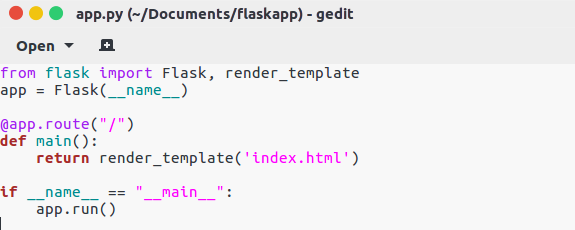
-   Nội dung file `index.html`

    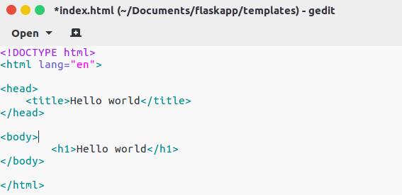
-   Tại thư mục chứa file `app.py` gõ lệnh `python app.py`, web mặc định chạy tại localhost: 127.0.0.1, port: 5000

    
    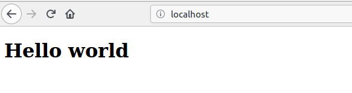
#### 6.1.3.2. Cho web chạy trên 2 port khác nhau
-   Sử dụng lệnh flask để chạy web trên 2 port khác nhau: port 8000 và port 8001
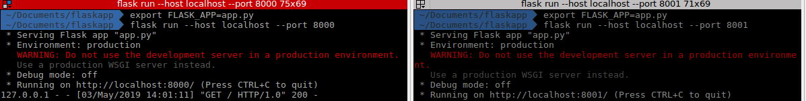
#### 6.1.3.3. Cài đặt nginx để load balancing giữa 2 port trên (verify lại bằng browser)
-   cd đường dẫn đến file config default của nginx trong thư mục sites-available
    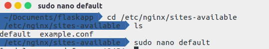
-   Thiết lập cài đặt như hình dưới đây, sau đó chạy lệnh `sudo service nginx start` để khởi động nginx hoặc `sudo service nginx restart` để khởi động lại nginx khi đã chạy rồi
    
-   Kiểm tra lại thông qua terminal
    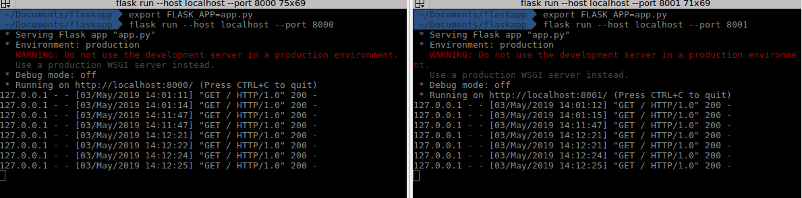
## 6.2. Caching


>Một cache là một nơi để lưu trữ một cái gì đó tạm thời trong một môi trường máy tính (computing environment). 

>Trong máy tính, dữ liệu hoạt động thường được cache (lưu trữ) để rút ngắn thời gian truy cập dữ liệu, giảm độ trễ và cải thiện đầu vào (input)/ đầu ra (output), viết tắt là (I/ O). Bởi vì hầu hết tất cả các workload của ứng dụng phụ thuộc vào các hoạt động I/ O, caching được sử dụng để cải thiện hiệu suất ứng dụng.

>Caching là quá trình lưu trữ dữ liệu trong cache.


### 6.2.1. Vai trò của cache, các thuật toán apply cho cache (LRU, LFU)

-   Caching cải thiện thời gian tải trang và có thể cắt giảm việc tải trên server và database của bạn. Trong mô hình trên, dispatcher sẽ đầu tiên tra cứu nếu yêu cầu được thực hiện và cố tìm kết quả trước để trả về, nếu tìm không ra thì chuyển hướng cho worker làm sau đó lưu lại kết quả vào cache
-   Cụ thể vai trò của cache trên Web (clients, servers):
    -   Cache giúp giảm tiêu thụ băng thông, giảm lưu lượng mạng, giảm tắc nghẽn
    -   Cache giảm độ trễ truy cập
    -   Cache giúp giảm khối lượng công việc của server
    -   Trong trường hợp máy chủ từ xa không khả dụng do sự cố hoặc phân vùng mạng, client có thể nhận được một bản sao được lưu trong bộ nhớ cache tại proxy. Do đó, sự mạnh mẽ của dịch vụ Web được tăng cường
-   Memory là giới hạn, nên khi cache đầy, ta cần loại bỏ một số phần tử ra khỏi cache. Vấn đề là làm sao để loại bỏ một cách hiệu quả? Thuật toán LRU hay LFU có thể apply cho cache để thực hiện điều đó dựa trên yêu cầu hay thói quen user
-   Thuật toán LRU (Least recently used) lựa chọn loại bỏ những phần tử nào mà ít được dùng gần đây nhất. Một key được định nghĩa là dùng khi có một thao tác get hoặc set vào key đó
    -   Để cài đặt LRU cache, chúng ta cần có 2 cấu trúc dữ liệu:
        -   Queue - có thể sử dụng Doubly linked list. Kích thước tối đa của queue sẽ bằng cache size. Các blocks được sử dụng gần đây nhất sẽ nằm ở đầu queue và các blocks ít được dùng gần đây nhất sẽ ở cuối queue
        -   Sử dụng HashMap để lưu chỉ số blocks và giá trị của nó 
           
    ```
        [A]
        [A, B]
        [A, B, C]
        [B, C, A] <- a stream of As keeps A at the head of the list.
        [C, A, B]
        [A, B, C]
        [B, C, D] <- here, we evict A, we can do better! 
    ```
-   Thuật toán LFU (Least frequently used) lựa chọn đối tượng bộ nhớ cache ít được sử dụng nhất

    ```
        A - 12
        B - 2
        C - 2
        D - 1
    ```
    -   Ta có thể thấy A có tần suất sử dụng cao nhất nên ta không nên loại bỏ ngay cả khi nó được sử dụng gần đây nhất
    -   Đối với thuật toán LFU này thì MinHeap là sự lựa chọn phù hợp, các thao tác thêm sửa xóa có độ phức tạp `O(logN)`. Cụ thể thực thi LFU như sau:
        -   Sử dụng một vector các `pair<int,int>` đại diện cho cache, mỗi pair bao gồm chỉ số block và số lần được dùng. Vector này được sắp xếp theo MinHeap, cho phép truy cập block ít dùng nhất trong `O(1)`
        -   Sử dụng HashMap để lưu chỉ số các blocks cache cho phép tìm kiếm với độ phức tạp hằng số

-   Các loại cache:
    -   Cache-aside:
    
        -   Ứng dụng chịu trách nhiệm đọc ghi từ storage. Cache không tương tác trực tiếp với storage. Quy trình như sau:
            -   Tìm các entry trong cache
            -   Nếu cache miss, load các entry từ database
            -   Thêm entry vào cache
            -   Trả về entry
        -   Việc đọc sau đó của data được thêm vào cache sẽ nhanh chóng. Chỉ những data được yêu cầu mới đưa vào cache, tránh đưa vào cache những data không sử dụng
        -   Nhược điểm:
            -   Mỗi cache miss dẫn đến 3 thao tác thêm, gây ra độ trễ nhất định
            -   Dữ liệu có thể trở nên cũ nếu được cập nhật trong database. Có thể giảm bớt bằng cách đặt time-to-live để bắt buộc cập nhật cache entry, hoặc dùng write-through
            -   Khi một node fails, nó được thay thế bởi một node mới, tăng độ trễ

    -   Write-through:
        
        -   Ứng dụng sử dụng cache như bộ nhớ chính, đọc và ghi vào đó, khi đó cache chịu trách nhiệm đọc ghi vào database:
            -   Ứng dụng thêm/cập nhật entry trong cache
            -   Cache đồng bộ ghi vào database
            -   Trả về entry
        -   Write-through tổng quan là thao tác chậm do việc ghi, nhưng các thao tác đọc sau đó của data vừa ghi thì nhanh. Người dùng thường dễ chấp nhận độ trễ của thao tác update hơn là thao tác read
        -   Nhược điểm:
            -   Khi một node mới được được tạo do failure hay scaling, node mới sẽ không đưa vào cache entries cho đến khi entry được cập nhật trong database
            -   Phần lớn data đã ghi không bao giờ được đọc, điều này có thể giảm thiểu nhờ time-to-live
    -   Write-back:
        
        -   Write-back thực hiện thao tác sau:
            -   Thêm/cập nhật entry trong cache
            -   Ghi entry vào database một cách bất đồng bộ, cải thiện khả năng ghi
        -   Nhược điểm:
            -   Data có thể bị mất nếu cache có vấn đề trước khi data được cập nhật vào database
            -   Khó để cài đặt và thực hiện hơn cache-aside và write-through 

### 6.2.2. Cài đặt nginx để phục vụ trang web tĩnh. Tìm cách để bật module cache cho nginx
-   Cài đặt trang web tĩnh có một hình ảnh, chạy bằng lệnh `python index.py`, web sẽ chạy trên localhost:5000:
    
    
    
    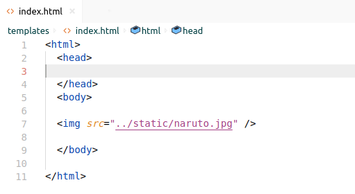
    
    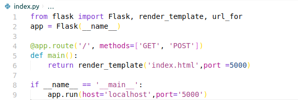
    
    
    
-   Config file default trong site-available của nginx để bật module cache, tạo một thư mục chứa cache tại home/cpu12454/cache, chỉnh đúng địa chỉ localhost:5000:

    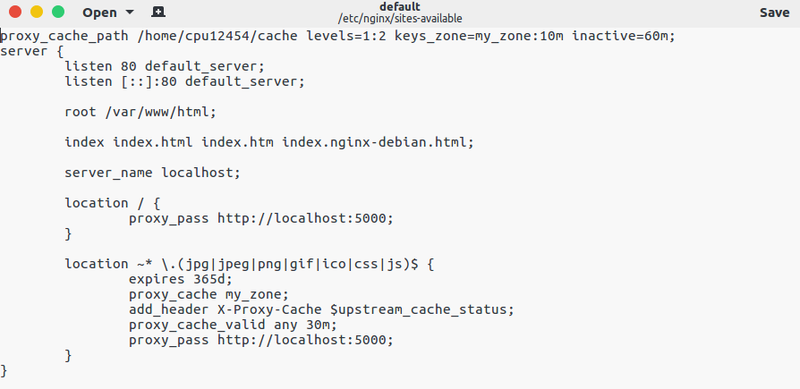

-   Tiếp theo, gõ lệnh liên kết file default trong sites-available vào default trong sites-enabled:
    ```bash
    sudo ln -sf /etc/nginx/sites-available/default /etc/nginx/sites-enabled/default
    ```
-   Kết quả kiểm tra cache HIT: lần đầu MISS, lần sau do đã cache lại nên đạt cache HIT:

    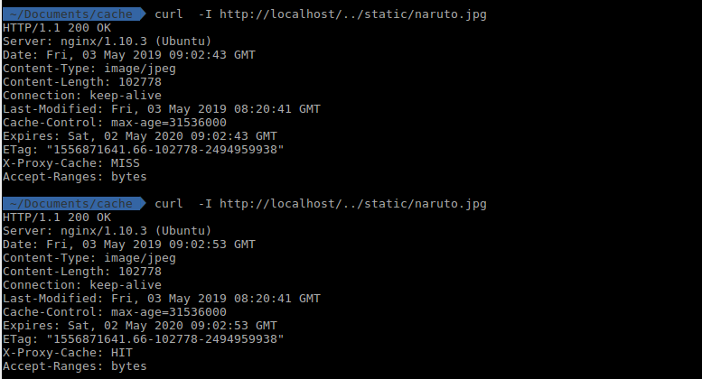
-   Kiểm tra thư mục cache đã có một folder đã mã hóa:

    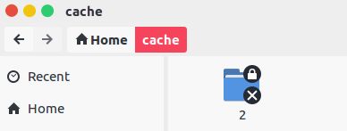
## 6.3. Redis

### 6.3.1. Khái niệm cơ bản về Redis
>  Redis (Remote Dictionary Server) là cơ sở dữ liệu NoSQL mã nguồn mở, lưu trữ dữ liệu dưới dạng KEY-VALUE với nhiều tính năng được sử dụng rộng rãi. Hỗ trợ nhiều kiểu dữ liệu như: strings, hashes, lists, sets, sorted sets. Redis có 2 tính chất cơ bản là in-memory và key-value store

-   Hiểu một cách ngắn gọn, Redis lưu trữ dữ liệu trên RAM theo dạng cặp key-value:
    ```
    name="narayan"
    profession=["web", "mobile"]
    ```

-   Ưu điểm:
    -    Redis hỗ trợ thêm mới, cập nhật, xoá dữ liệu một cách nhanh chóng. Redis rất nhanh có thể thực hiện khoảng 110000 set dữ liệu trên giây, và 81000 get dữ liệu/giây.
    -   Hỗ trợ hầu hết các kiểu dữ liệu và các developers cần
    -   Nhiều công cụ tiện ích có thể sử dụng trong một số trường hợp như bộ nhớ đệm và hàng đợi tin nhắn
    -   Bạn có thể cấu hình cho key tự động xoá trong khoảng thời gian nhất định(expire)
    -   Dữ liệu được lưu trữ trên RAM giúp việc truy xuất dữ liệu một cách nhanh chóng. Ngoài ra bạn có thể cấu hình để Redis có thể lưu trữ dữ liệu trên ổ cứng.
-   Nhược điểm:
    -   Bù lại thì tốc độ cao thì dung lượng của bộ nhớ primary memory sẽ bị giới hạn
    -   Không thể lưu một lượng dữ liệu quá lớn trên RAM, chỉ có thể lưu trữ lượng thông tin nhỏ phục vụ thêm xóa sửa ở tốc độ cao. Nếu muốn lớn hơn chỉ có thể lưu xuống ở cứng rồi load lên
-   Kiến trúc của Redis:
    -   Kiến trúc Redis bao gồm 2 tiến trình chính là: Redis client và Redis server
    
    -   Redis client và server có thể cùng một máy tính hoặc khác nhau
    -   Redis server chịu trách nhiệm lưu trữ dữ liệu trong bộ nhớ, xử lý nhiệm vụ quản lý và các phần quan trọng nhất của kiến trúc. Redis client có thể là Redis console client hoặc các chương trình sử dụng Redis API
    -   Redis lưu trữ mọi thứ trên RAM vì vậy dễ bị mất hết dữ liệu nên cần đảm bảo tính toàn vẹn của dữ liệu ghi ra disk
-   Ứng dụng:
    -   Caching: Sử dụng làm bộ nhớ đệm. Chính tốc độ đọc ghi nhanh mà Redis có thể làm bộ nhớ đệm, nơi chia sẻ dữ liệu giữa các ứng dụng hoặc làm database tạm thời.
    -   Counter: Sử dụng làm bộ đếm. Redis hỗ trợ thread safe do đó nó có thể đồng bộ dữ liệu giữa các request.
    -   Publish/Suscribe: Tạo kênh chia sẻ dữ liệu.Redis hỗ trợ tạo các channel để trao đổi dữ liệu giữa publisher và subscriber giống như channel trong Socket Cluster hay topic trong Apache Kafka
    -   Queues: Tạo hàng đợi để xử lý lần lượt các request
-   Redis ghi file lên Disk (Redis Persistence):
    -   Redis lưu trữ dữ liệu lên RAM, do vậy việc đọc ghi sẽ thao tác trên RAM mang lại tốc độ rất nhanh. Tuy nhiên, nếu server bị tắt, toàn bộ dữ liệu lưu trên RAM sẽ bị mất. Khi đó Redis cần phải bảo toàn được dữ liệu lưu trữ trên RAM bằng cách sao lưu dữ liệu ra ổ cứng: `ghi ra file RDB`, `ghi ra file AOF` và `SAVE command`.
        -   Ghi ra file RDB (Redis Database File): 
            -   Thực hiện sao lưu vào ổ cứng sau một khoảng thời gian nhất định, dữ liệu mã hóa để giảm kích thước lưu trên đĩa
            -   Ưu điểm: cho phép lưu các version khác nhau của database, dễ dàng chuyển data đến các data centers khác nhau, tối ưu hóa hiệu năng Redis. Khi restart server RDB làm việc với data lớn sẽ nhanh hơn AOF
            -   Nhược điểm: không tốt nếu muốn giảm thiểu tối đa mất mát dữ liệu
        -   Ghi ra file AOF (Append Only File):
            -   Lưu lại tất cả dữ liệu dưới dạng command và nhóm lại thành các block. Command sẽ chạy lại và tái thiết lặp server khi restart
            -   Ưu điểm: đảm bảo dataset được bền vững hơn RDB, có thể config để Redis ghi log theo từng câu query hoặc mỗi giây một lần
            -   Nhược điểm: file AOF thường lớn hơn RDB với cùng 1 dataset. Có thể chậm hơn RDB tùy thuộc vào cách thiết lập khoảng thời gian sao lưu vô hệ thống. Có thể không thể tái tạo lại chính xác dataset khi restart Redis
        -   SAVE command:
            -   Buộc Redis server tạo một RDB snapshot bất cứ lúc nào sử dụng Redis console client  SAVE command
-   Redis Replication:
    -   Nhân bản Redis là một môi trường mà nhiều máy tính chia sẻ cùng dữ liệu, nếu một máy bị lỗi, dữ liệu vẫn được bảo toàn trên các máy còn lại
    
    -   Một master server có nhiều slave server, khi một slave mới thêm vào thì master sẽ đồng bộ dữ liệu vào slave mới. Tất cả truy vấn điều chuyển hướng đến master, sau đó thay đổi sẽ đồng bộ từ master vào các slaves. Khi một lượng lớn sort và đọc, master có thể phân tán cho slave thực hiện đồng thời. Một slave fail, hệ thống vẫn hoạt động, khi slave hoạt động lại, slave được cập nhật mới
-   Redis cluster:
    -   Đây là một kỹ thuật chia nhỏ data vào nhiều máy tính. Bởi vì nhiều data có thể được lưu trong cluster bởi vì tổ hợp nhiều máy tính
    
    -   Hình trên data chia thành 4 nodes, mỗi node là một redis server được cấu hình cluster node. Nếu 1 node fails, toàn bộ dừng hoạt động
-   Replication và cluster kết hợp:
    -   Điểm yếu của cluster đó là khi một node dừng thì cả hệ thống cũng dừng hoạt động mà không có cách nào lấy lại data đã mất. Giaỉ pháp là dùng Replication để sao lưu mỗi node thường xuyên
  
    
    -   Chuyển mỗi node server thành master server, mỗi master sẽ có một slave, nếu một master fails, slave sẽ thay thế master tiếp tục vận hành hệ thống

### 6.3.2. Các cấu trúc dữ liệu của Redis. Khi nào dùng `hyperloglog`
-   String: string, integer hoặc float. Redis có thể làm việc với cả string, từng phần của string, cũng như tăng/giảm giá trị của integer, float. String có độ dài tối đa 512 MB

    -   Có thể thao tác trên String như sau:
        -   Sử dụng String như các biến đếm bằng các nhóm lệnh: INCR, DECR, INCRBY
            
            ```bash
            redis>  SET mykey "10"
            "OK"
            redis>  INCR mykey
            (integer) 11
            redis>  GET mykey
            "11"
            redis> 
            ```
        -   Thêm vào String với lệnh APPEND
            
            ```bash
            redis>  EXISTS mykey
            (integer) 0
            redis>  APPEND mykey "Hello"
            (integer) 5
            redis>  APPEND mykey " World"
            (integer) 11
            redis>  GET mykey
            "Hello World"
            redis>  
            ```
        -   Sử dụng String như một vector truy xuất ngẫu nhiên với GETSTRANGE và SETSTRANGE
            
            GETSTRANGE
            ```bash
            redis>  SET mykey "This is a string"
            "OK"
            redis>  GETRANGE mykey 0 3
            "This"
            redis>  GETRANGE mykey -3 -1
            "ing"
            redis>  GETRANGE mykey 0 -1
            "This is a string"
            redis>  GETRANGE mykey 10 100
            "string"
            redis>  
            ```
            SETSTRANGE
            ```bash
            redis>  SET key1 "Hello World"
            "OK"
            redis>  SETRANGE key1 6 "Redis"
            (integer) 11
            redis>  GET key1
            "Hello Redis"
            redis>  
            ```
        -   Mã hóa lượng lớn Data vào không gian nhỏ, tạo một Redis backed Bloom Filter bằng GETBIT và SETBIT
            ```bash
            redis>  SETBIT mykey 7 1
            (integer) 0
            redis>  GETBIT mykey 0
            (integer) 0
            redis>  GETBIT mykey 7
            (integer) 1
            redis>  GETBIT mykey 100
            (integer) 0
            redis>  
            ```

-   List: danh sách liên kết của các strings. Redis hỗ trợ các thao tác push, pop từ cả 2 phía của list, trim dựa theo offset, đọc 1 hoặc nhiều items của list, tìm kiếm và xóa giá trị.

    
    -   LPUSH thêm phần tử mới vào head (bên trái) và RPUSH thêm phần tử mới vào tail (bên phải)
  
        ```bash
        LPUSH mylist a   # now the list is "a"
        LPUSH mylist b   # now the list is "b","a"
        RPUSH mylist c   # now the list is "b","a","c" (RPUSH was used this time)
        ```
    -   Độ dài tối đa của List là 2<sup>31</sup> -1 phần tử (khoảng 4 tỷ). Thao tác thêm và xóa phần tử có độ phức tạp O(1), tuy xuất phần tử có độ phức tạp O(n)
-   Set: tập hợp các string (không được sắp xếp). Redis hỗ trợ các thao tác thêm, đọc, xóa từng phần tử, kiểm tra sự xuất hiện của phần tử trong tập hợp. Ngoài ra Redis còn hỗ trợ các phép toán tập hợp, gồm intersect/union/difference.

    
    -   Có thể thêm các phần tử phân biệt vào một set bằng SADD (ví dụ muốn biết tất cả địa chỉ IP phân biệt ghé thăm website)
        
        ```bash
        redis>  SADD myset "Hello"
        redis>  SADD myset "Hello"
        (integer) 1
        redis>  SADD myset "World"
        (integer) 1
        redis>  SADD myset "World"
        (integer) 0
        redis>  SMEMBERS myset
        1) "World"
        2) "Hello"
        redis>  
        ```
-   Sorted Set: là 1 danh sách, trong đó mỗi phần tử là map của 1 string (member) và 1 floating-point number (score), danh sách được sắp xếp theo score này. Redis hỗ trợ thao tác thêm, đọc, xóa từng phần tử, lấy ra các phần tử dựa theo range của score hoặc của string.

    

    -   Ví dụ:
        
        ```bash
        redis>  ZADD myzset 1 "one"
        (integer) 1
        redis>  ZADD myzset 2 "two"
        (integer) 1
        redis>  ZADD myzset 3 "three"
        (integer) 1
        redis>  ZRANGE myzset 0 -1
        1) "one"
        2) "two"
        3) "three"
        redis>  ZRANGE myzset 2 3
        1) "three"
        redis>  ZRANGE myzset -2 -1
        1) "two"
        2) "three"
        redis>  
        ```
-   Hash: lưu trữ hash table của các cặp key-value, trong đó key được sắp xếp ngẫu nhiên, không theo thứ tự nào cả. Redis hỗ trợ các thao tác thêm, đọc, xóa từng phần tử, cũng như đọc tất cả giá trị.

    
    -   Ví dụ:
        
        ```bash
        HMSET user:1000 username antirez password P1pp0 age 34
        HGETALL user:1000
        HSET user:1000 password 12345
        HGETALL user:1000
        ```
-   `Hyperloglog` là một cấu trúc dữ liệu mang tính xác suất được dùng để đếm giá trị duy nhất. Ví dụ, địa chỉ IP của những người truy cập một website, các cụm từ tìm kiếm, địa chỉ email:
    -   Việc đếm các giá trị duy nhất với độ chính xác hoàn toàn yêu cầu một bộ nhớ tương xứng với số các giá trị duy nhất đó. Không có cách nào xác định một giá trị đã xuất hiện hơn là so sánh nó với giá trị đã xuất hiện trước đó. Bộ nhớ có giới hạn nên dẫn đến vấn đề trong việc xử lí tập dữ liệu lớn
    -   `Hyperloglog` giải quyết vấn đề này bằng việc cho phép đánh đổi việc tiêu thụ bộ nhớ với độ chính xác bằng việc ước lượng số lượng phần tử lớn hơn 10^9 với độ lệch chuẩn 2% và sử dụng chỉ 1.5 kilobytes bộ nhớ
    -   `Hyperloglog` trong Redis chiếm 12 kilobytes bộ nhớ và có thể xấp xĩ với độ lệch chuẩn 0.81%. 12 kilobytes này không tính dung lượng lưu trữ key thực sự
    -   Ý tưởng của `Hyperloglog`:
        -   Dựa trên việc quan sát lực lượng của một tập hợp các số ngẫu nhiên được phân phối đồng đều, chúng có thể ước lượng được bằng việc đếm số các 0 dài nhất đầu tiên trong biểu diễn nhị phân của các số  trong tập hợp
        -   Ví dụ, một tập hợp các số nguyên 64-bit đều được biễu diễn dưới dạng nhị phân với dãy 64-bit, tìm được dãy số 0 đầu tiên dài nhất là n, thì ước lượng số phần tử phân biệt là 2^n
        -   Tuy nhiên dữ liệu của một set không phải lúc nào cũng là số nguyên nên có một hàm Hash để băm giá trị thành một tập hợp các số nguyên ngẫu nhiên phân bố đều tương ứng. Các bit đầu tiên của giá trị đã băm được dùng để chia thành các tập con, mỗi tập con tìm số 0 đầu dài nhất.  Ước lượng với tất cả tập hợp sử dụng trung bình điều hòa ([harmonic mean](https://en.wikipedia.org/wiki/Harmonic_mean))

    -   Trong Redis, `Hyperloglog` sử dụng thông qua các lệnh PFADD (thêm phần tử vào `Hyperloglog`), PFCOUNT (đếm số phần tử phân biệt với `Hyperloglog`), PFMERGE (tạo ra một `Hyperloglog` có thể xấp xỉ lực lượng của hội 2 hay nhiều `Hyperloglog` đang tồn tại)
    
    ```bash
    > PFADD visitors alice bob carol
    (integer) 1
    > PFADD customers alice dan
    (integer) 1
    > PFMERGE everyone visitors customers
    OK
    > PFCOUNT everyone
    (integer) 4
    ```
### 6.3.3. Cách đặt tên key cho phù hợp
-   Redis key có độ an toàn nhị phân, điều này có nghĩa bạn có thể sử dụng chuỗi nhị phân như một key, từ một chuỗi "foo" cho đến nội dung của file JPEG. Chuỗi rỗng cũng là một key hợp lệ
-   Có một số quy tắc sau:
    -   Không nên đặt key quá dài. Bởi vì một key quá dài không chỉ tốn không gian bộ nhớ mà còn tốn nhiều thời gian cho thao tác tìm kiếm
    -   Key quá ngắn thường cũng không tốt. Ví dụ: đặt key "u1000flw" thay vì "user:1000:follower", tên quá ngắn làm người khác khó nắm bắt nội dung mặc dù nó tiết kiệm không gian lưu trữ, chúng ta nên cân bằng giữa 2 việc này
    -   Cố gắng bám sát cấu trúc sau: "object-type:id", ví dụ: "user:1000". Có thể dùng dấu '.' hoặc '-' đối với key có cụm  từ như "comment: 1234 :reply-to"
    -   Kích thước tối đa của key là 512MB
### 6.3.4. Config cluster redis 3 node, chạy cùng machine, khác port
-   Chỉ Redis 3.0 trở lên mới hỗ trợ cluster
-   Đầu tiên, ta tải file Redis-stable về, giải nén và cài đặt với lệnh sau:
    
    ```bash
    wget http://download.redis.io/redis-stable.tar.gz
    tar xvzf redis-stable.tar.gz
    cd redis-stable
    sudo make install
    ```
-   Để đảm bảo việc cài đặt thành công, gõ lệnh: make test -> `All test pass without errors!`
-   Ta sẽ tiến hành config 3 cluster với các port như sau: 6398, 6399, 6400 (việc chọn port là tùy ý miễn là các port đó chưa bị chiếm)
-   Trong thư mục Redis-stable lúc nãy, ta tạo thư mục `cluster`, trong thư mục `cluster`, tạo 3 thư mục con có tên là số port gồm `6398`, `6399`, `6400`. Trong mỗi thư mục port đó, tạo 1 file config cho master và 1 file config cho slave (nếu bạn muốn thực hiện vừa cluster vừa replication)
    
    | Server   |     Master    | Slave |
    |----------|---------------|-------|
    |     1    |      6398     |  6400 |
    |     2    |      6399     |  6398 |
    |     3    |      6400     |  6399 |

-   Cây thư mục lưu trữ như sau:

    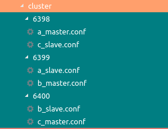
-   Cấu hình trong file a_master.conf, ta thực hiện tương tự với các file còn lại, chỉ thay đổi port:

    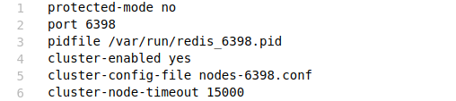
-   Để thực hiện cluster cho 3 node, ta lần lượt chạy 3 server với config master bằng lệnh sau tại thư mục cluster chứa 3 thư mục port:
    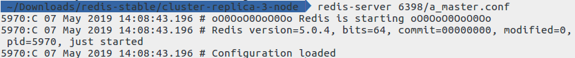
-   Server với port 6399 và 6400 chạy tương tự chỉ đổi tên file tương ứng với b_master.conf và c_master.conf
-   Sau khi chạy 3 server trên, ta thực hiện kết nối 3 server này với IP: 127.0.0.1 như sau:

    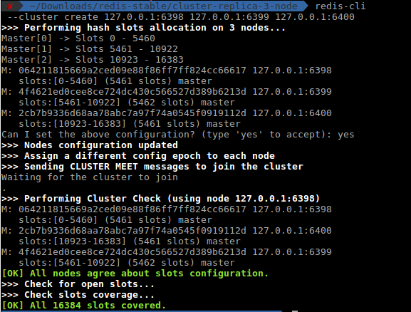
-   Kiểm tra thông tin cluster hiện tại:

    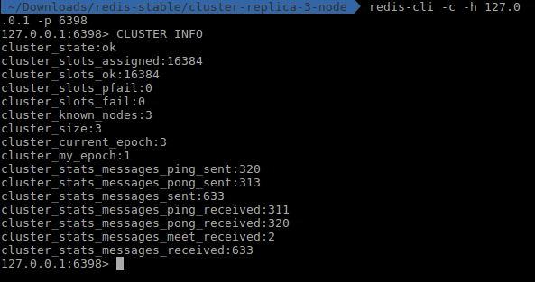

-   Kiểm tra cluster có thành công không:
    
    
-    Các bước cài đặt và các file cần thiết được tham khảo tại link: [linode.com](https://www.linode.com/docs/applications/big-data/how-to-install-and-configure-a-redis-cluster-on-ubuntu-1604/). Để liên kết slave với master tham khảo thêm tại link trên
### 6.3.5. Chương trình chat đơn giản sử dụng Redis pub/sub (dùng Java, Maven, và thư viện Redisson). Lưu dữ liệu chat cho mỗi người, set expire trong 1 ngày
-   Cài đặt IntelliJ Idea tại [link](https://www.jetbrains.com/idea/download/#section=linux). Ta sẽ sử dụng IDE này để lập trình chương trình chat
-   Cài đặt Java SDK tại [link](https://www.oracle.com/technetwork/java/javase/downloads/index.html). Ngôn ngữ lập trình là Java
-    Chọn project maven khi khởi tạo:

-   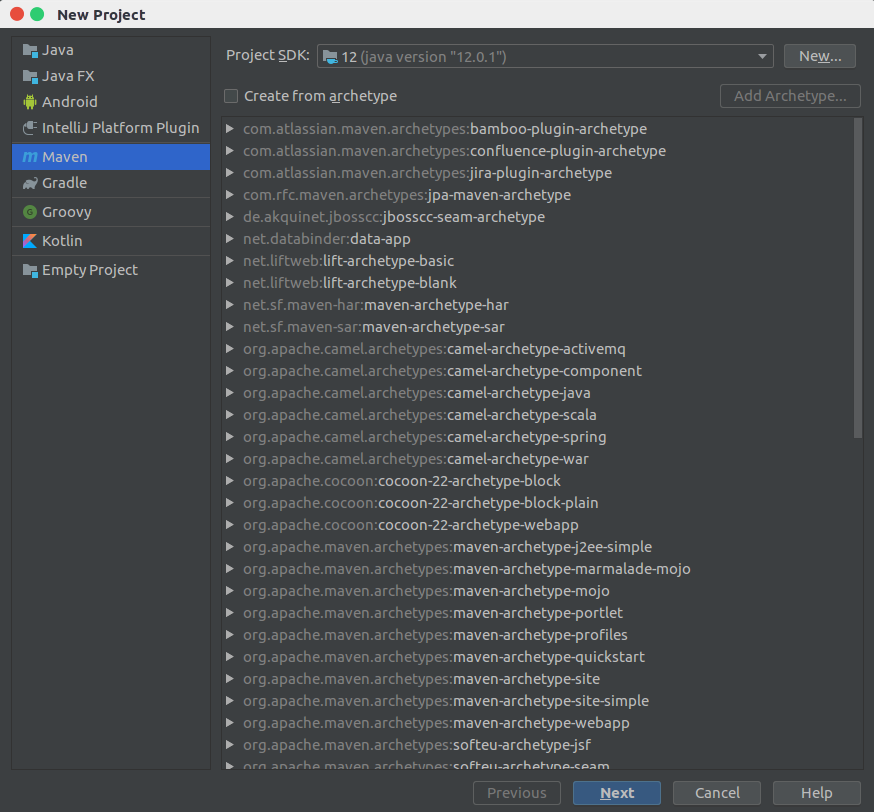

-   Thêm thư viện Redisson vào file `pom.xml`:

    ```xml
    <dependencies>
     <dependency>
            <groupId>org.redisson</groupId>
            <artifactId>redisson</artifactId>
            <version>3.10.7</version>
        </dependency>
    </dependencies>    
    ```

-   Cơ chế PUB (PUBLISH): hiểu đơn giản là đẩy dữ liệu vào một channel
-   Cơ chế SUB (SUBSCRIBE): đăng ký vào một kênh, giống cơ chế subscribe của youtube, khi đăng ký một channel, chỉ cần có thông tin update trong channel thì người subscribe sẽ nhận được thông tin đó 
    
    

-   Để tham gia vào một channel chat, ta cần một tên channel, tên user. Để lưu nội dung tin nhắn thì cần một object lưu thêm thông tin message và thời gian truyền message đó
-   Nhưng trước hết ta cần thực hiện việc kết nối vào server redis, ta cần đảm bảo server redis đang hoạt động: `redis-server start`
    
    ```java
    private static void connectServer() {
        Config config = new Config();
        config.useSingleServer()
                .setAddress("redis://127.0.0.1:6379");
        redissonClient = Redisson.create(config);
    }
    ```
-   Ta tạo một đối tượng redissonClient kết nối vào Redis server như trên
-   Tiếp theo, ta cần một đối tượng để lưu các tin nhắn bằng RListMultimapCache với key là channel và value là các `ChatObject`, class `ChatObject` do chúng ta tự định nghĩa. Mục đích để khi join vào một channel thì cần load lại những tin nhắn trước đó. Hơn nữa, RListMultimapCache có thể set expire theo thời gian
-   Bây giờ, ta tiến hành sub như sau: dùng `redissonClient` để `getTopic` từ một `channel`. Sử dụng hàm lắng nghe message, mỗi khi có message thì in ra:
    
    ```java
    static void sub(){
        subTopic = redissonClient.getTopic(channel);
        subTopic.addListener(ChatObject.class, new MessageListener<ChatObject>() {
            public void onMessage(CharSequence charSequence, ChatObject chatObject) {
                System.out.println(chatObject.toString());
            }
        });
    }
    ```
-   Bước tiếp theo, thực hiện pub vào channel thông báo có người mới join vào channel và lưu cache lại:
    
    ```java
    static void pub(){
        pubTopic = redissonClient.getTopic(channel);

        ChatObject chatObject=new ChatObject(channel,username, "joined the channel!", getTime());

        pubTopic.publish(chatObject);
        putMessageToCache(channel,chatObject);
    }
    ```
-   Sau đó, chỉ cần nhập message và gửi pub với message và time để gửi tin nhắn vào channel:
    
    ```java
    private static void chatAndPubToChannel() {
        while (true) {
            scanner = new Scanner(System.in);
            String message = scanner.nextLine();
            if (message.equals(":wq")) {
                System.out.println("You have left the channel! Bye bye my babe!!!");
                pub("has left the channel!!!");
                System.exit(0);
            }
            else
                pub(message);
        }
    }

    static void pub(String message){
        System.out.println("--------------------");
        System.out.println("If you want to quit, type: ':wq'\nPUB channel message: ");

        pubTopic = redissonClient.getTopic(channel);
        pubTopic.publish(new ChatObject(channel,username,message, getTime()));
        putMessageToCache(channel,new ChatObject(channel,username,message, getTime()));
    }
    ```

-   Định nghĩa class ChatObject (cần phải có Serializable để để đẩy Object vào Redis DB):
    
    ```java
    public class ChatObject implements Serializable {
        String channel;
        String user;
        String message;
        String date;
        ...    
    }
    ```
-   Như vậy, chúng ta đã hoàn thành xong chương trình chat đơn giản. Nguồn tham khảo tại [link](//https://github.com/redisson/redisson/wiki/6.-Distributed-objects)

    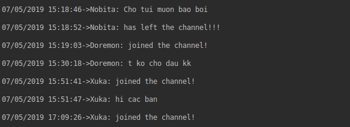